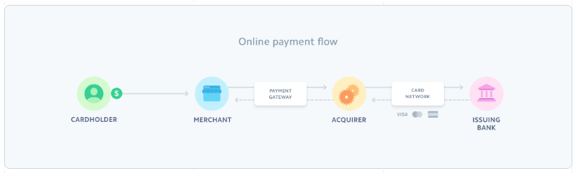
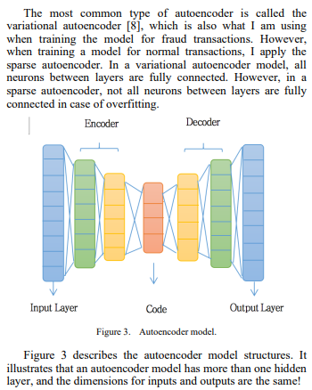
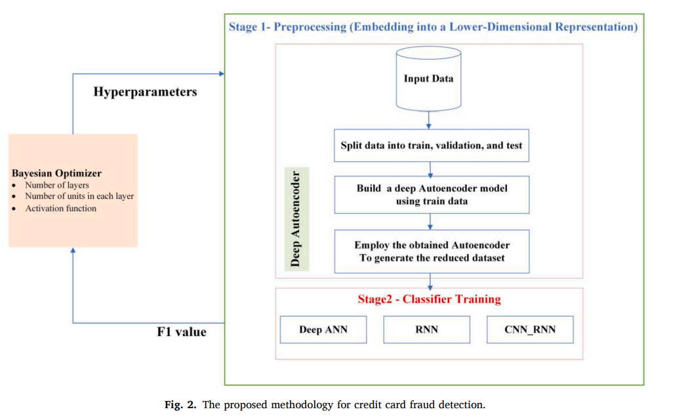
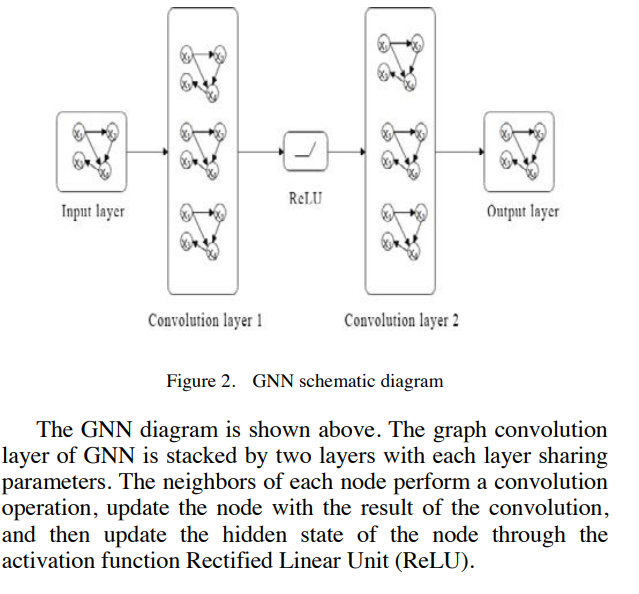

# Payment Fraud

## Introduction to collecting online payments (n.d.)

Stripe (n.d.) Introduction to collecting online payments. https://stripe.com/guides/introduction-to-online-payments. [Intro](Intro.pdf).

There are four major players involved in each online transaction:

1. Cardholder: The person who owns a credit card
2. Merchant: The business owner
3. Acquirer: A bank that processes credit card payments on behalf of the merchant and routes them through the card networks (such as Visa, Mastercard, Discover, or American Express) to the issuing bank. Sometimes acquirers may also partner with a third party to help process payments.
4. Issuing bank: The bank that extends credit and issues cards to consumers on behalf of the card networks.

## What protocol is used

The [ISO 20022 standard](https://en.wikipedia.org/wiki/ISO_20022) defines a [message catalogue](https://www.iso20022.org/iso-20022-message-definitions) that can be used for exchanges between an acquirer and an issuer, and may also involve intermediary agents as well. The messages include authorisation messages, reversal messages, financial messages, addendum messages, amendment message, retrieval messages, chargeback messages, inquiry messages and verification messages.

The [ISO 8583 protocol](https://en.wikipedia.org/wiki/ISO_8583) is a messaging standard used for payment card originated financial transactions between an acquirer and a card issuer. It is used to exchange electronic data between devices that are connected to different systems.

## Online Transaction Fraud Detection System Based on Machine Learning (2022)

Virjanand1, Rajkishan Bharti, Shubham Chauhan, Suraj Pratap Singh4, Chhiteesh Rai (2022). Online Transaction Fraud Detection System Based on Machine Learning. International Research Journal of Engineering and Technology (IRJET). Volume: 09 Issue: 03 | Mar 2022. https://www.irjet.net/archives/V9/i3/IRJET-V9I3107.pdf. [IRJET-V9I3107](IRJET-V9I3107.pdf)

> In order to detect fraudulent user behavior, we gather the necessary information at registration. The details of items purchased by any individual  transaction are generally unknown to any Fraud Detection System (FDS) running at the bank that issues credit cards to cardholders. BLA is being used to resolve this problem (Behavior and Location Analysis). A FDS is a credit card issuing bank. Every pending transaction is sent to the FDS for approval. To determine whether or not the transaction is genuine, FDS receives the card information and transaction value.

- S. Nami and M. Shagari note that recent cardholder transactions had a strong impact on assessing whether a transaction is fraudulent or not, according to the experimental results, which were done using a real dataset from a bank. This suggests that an fraud system should implement a sliding window or top-K previous results. For instance, if the person lives in NYC and has a transaction in Paris its potentially fraud. However, if there's also charges for hotels, planes, and lunch in Paris its more likely valid.

- Logical Graph of Behavior Profiles (LGBP) __were effective__ for capturing the reasoning link between transaction record characteristics. Existing research into this topic is available since at least 2018. At least three publications show that __Markov processes are ineffective__ at modeling habits due to the "buy everything online movement." People jump categories from wine to books to porn to fishing in a matter of clicks.

> The FDS has no understanding of the technology purchased in that transaction. The bank refuses the transaction if FDS confirms it is fraudulent. If an unexpected pattern is identified, the system must be re-verified using the users' spending habits and geographic location. The system detects unusual patterns in the payment procedure based on the user's previous information. After three unsuccessful attempts, the system will ban the user.

A. Kumar and Gupta examine several supervised ML strategies with Logistic Regression exceeding all of them.

## Transaction Fraud Detection Based on Total Order Relation and Behavior Diversity (2018)

L. Zheng, G. Liu, C. Yan and C. Jiang, "Transaction Fraud Detection Based on Total Order Relation and Behavior Diversity," in IEEE Transactions on Computational Social Systems, vol. 5, no. 3, pp. 796-806, Sept. 2018, doi: 10.1109/TCSS.2018.2856910. [LGBP.2018](LGBP.2018.pdf).

> A survey of over 160 companies reveals that the number of online frauds is 12 times higher than that of the offline frauds [25], and the losses can increase yearly at double-digit rates by 2020 [14]. [...] Therefore, it is much easier for a fraudster to make a fraud. There are many ways by which fraudsters can illegally obtain the card information of a user: phishing (cloned websites) [3], [28], pseudobase station [39], trojan virus [15], collision attack [17], malicious insider [6], and so on. Therefore, it is very interesting and significant to study the methods of fraud detection.

### What are common detection strategies

Currently, there are __two kinds of methods of fraud detection__ : `misuse detection` and `anomaly detection`.

There is extensive research into supervised algorithms which are effective to existing patterns. However, they breakdown in when Alice goes on vacation and diverges from her routine. User specific characteristics are frequently ignored within supervised transaction inspection further limiting effectiveness to sophisticated attacks.

Anomaly detection defines _behavior profile_ for users and relies on statistical modeling to determine the likelihood that transaction fits. This approach is feasible but has several edge cases. For instance, parents may share their card with their children.

Markov chains use the transaction attributes (e.g., amount and category) to determine the transitional probability. For instance, people spend $100 at gas stations all the time. However, a charge for $10,000 is suspecious or potentially erroneous. More sophisticated use cases of Markov chains are challenging in the online era since users can purchase from multiple states in a few clicks. That said, if the card is physically swiped there's still potential value to these strategies.

## Fraud Detection in Online Payments using Machine Learning Techniques (2023)

Siddaiah, U., Anjaneyulu, P., Haritha, Y., & Ramesh, M. (2023). Fraud Detection in Online Payments using Machine Learning Techniques. 2023 7th International Conference on Intelligent Computing and Control Systems (ICICCS), Intelligent Computing and Control Systems (ICICCS), 2023 7th International Conference On, 268–273. https://doi.org/10.1109/ICICCS56967.2023.10142404. [FD_using_ML](FD_using_ML.pdf).

> Fraud detection is the process of keeping track on user populations' activities to gauge, identify, or prevent undesirable behaviour including fraud, intrusion, and defaults. The majority of the time, a person who has fallen victim to such scam doesn't realize it until it's too late.

The authors examine various binary classification strategies based on Logistic Regression, Linear SVM, and SVM with RBF kernel. They found that XGBoost was the most effective for the [IEEE-CIS dataset](https://www.kaggle.com/competitions/ieee-fraud-detection/). Using Gradient Boosting had an 98% accuracy and Random Forest was 87%.

> Autoencoders are a perfect option in this situation because they are trained exclusively on ordinary communications. Transactions that are fraudulent are
recognised as being unusual. Despite being relatively expensive at first, The labelling of data sets can benefit from autoencoder training. Once there is enough labelled data, it may be used to either build brand-new supervised learning models or retrain ones that already exist.

Gradient boosting only solves part of the problem. More sophisticated detections should consider AE algorithms.

### Avoiding oversampling

Its challenging to deal with infrequient fraudulant transactions in training data because they're <1% of total transactions. They used __Synthetic Minority Oversampling Method__ (SMOTE).

> The Synthetic Minority Oversampling Technique (SMOTE) is an oversampling technique used in data mining and machine learning to handle imbalanced datasets. It involves generating synthetic samples from the minority class instead of creating copies of existing samples1. SMOTE works by selecting examples that are close in the feature space, drawing a line between the examples in the feature space and drawing a new sample at a point along that line1. This technique is used to avoid overfitting when training a classifier.

## Credit Card Fraud Detection Using Autoencoder-Based Deep Neural Networks (2021)

Shen, J. (2021). Credit Card Fraud Detection Using Autoencoder-Based Deep Neural Networks. 2021 IEEE 2nd International Conference on Big Data, Artificial Intelligence and Internet of Things Engineering (ICBAIE), Big Data, Artificial Intelligence and Internet of Things Engineering (ICBAIE), 2021 IEEE 2nd International Conference On, 673–677. https://doi.org/10.1109/ICBAIE52039.2021.9389940. [Fraud_AE.pdf](Fraud_AE.pdf).

There is an extensive presidence for researchers to combine detection models to overcome limitations. The authors combine two unsupervised models on the [European cardholder dataset](https://www.kaggle.com/datasets/mlg-ulb/creditcardfraud) one for known fraud and the other for known legit traffic.

They built the models using sparse autoencoders, which doesn't fully connect all neurons and minimizes overfitting. This approach is interesting, but the dataset isn't particularly useful since it has 492 of 284807 fraud records.

## A novel combined approach based on deep Autoencoder and deep classifiers for credit card fraud detection (2023)

Fanai, H., & Abbasimehr, H. (2023). A novel combined approach based on deep Autoencoder and deep classifiers for credit card fraud detection. Expert Systems With Applications, 217. https://doi.org/10.1016/j.eswa.2023.119562. [DeepAutoencoderClassifier](DeepAutoencoderClassifier.pdf).

There is extensive research into big data/AI models for detecting fraud and they are very effective at `binary classification`. However, the problem of detecting fraudulent transactions using classification techniques involves various challenges (Correa Bahnsen,Aouada, Stojanovic, & Ottersten, 2016):

1. class imbalance (the ratio of fraudulent transactions to normal transactions is very small)
2. cost sensitivity, i.e., the costs of misclassifying the fraudulent and normal transactions are not equal
3. temporal dependence between transactions
4. the presence of concept drift, i.e., Class conditional distributions change over time, requiring the classifier to be updated
5. dimensionality of search space feature preprocessing.

### How are researchers implementing deep learning

|Reference| Contribution| Modeling techniques|Dimension reduction (Yes or No): with what method|
|---------|--------------|-------------------|--------------------------------------------------|
|(Forough & Momtazi, 2021)|Proposing a novel ensemble method of deep sequential neural network to predict credit card frauds.|LSTM, GRU,Ensemble of RNNs|No|
(Jurgovsky et al., 2018) |Proposing two approaches. 1.RNNs for sequence classification. 2.Using traditional feature engineering (Adding time delta as an additional feature + Feature aggregation). |LSTM and (Random Forest for comparison) |No
(Fiore et al.,2019) |Proposing a framework for generating synthetic fraud data using GAN and comparing the results with SMOTE in the same way. |ANN classifier  |No
(Sohony, Pratap, & Nambiar, 2018) |Proposing an algorithm to partition dataset and train different models on each partition and finally ensemble all models. |ANN, Random Forest, Logistic Regression| No
(Forough & Momtazi, 2022)| Proposing an algorithm to undersample data by a sliding window. |ANN, GRU, LSTM, LSTM-CRF|No
(Benchaji et al., 2021) |Proposing a method containing steps are: Feature selection then using dimension reduction algorithms and applying data to two  proposed deep models.| LSTM, Attention Mechanism|Yes, manually selecting features then using PCA, tSNE, UMAP for dimension reduction.
(Tingfei, Guangquan, & Kuihua,2020)|Using GAN and VAE to overcome imbalance problem then comparing the results with SMOTE.|ANN| No|
(Correa Bahnsen et al., 2016) |Proposed to capture customers spending pattern and also use time of the transactions for better classification.| Decision Tree, Logistic Regression, Random Forest |No
(Yuksel et al., 2020)| Proposed to use dimension reduction algorithms for preparing data for KNN classifier.|KNN | Yes, using PCA and NCA
(Saia & Carta, 2019)| Proposing new proactive approaches, one based on the Fourier transform, and one based on the Wavelet transform for credit card fraud detection. These approaches only non-fraudulent data. The exploited proactive approaches show similar performance to Random Forest method.  |Two proactive methods based on DWT and DFT |No
(Laurens, Jusak, & Zou, 2017)| Proposing a new proactive fraud detection model using invariant diversity to uncover patterns among characteristics of the devices that are used in executing the transactions. The model fits a regression function on diversity index of various attributes, which is employed to detect fraudulent transactions.|Regression |No
(Singh & Jain, 2019) | Evaluating the effectiveness of the filter and wrapper feature selection methods in enhancing the performance of some classifiers |Decision tree,  AdaBoost, Random Forest, Naive Bayes, and Projective Adaptive Resonance Theory (PART)|Feature selection based on Information gain, and a wrapper feature selection method.
(Vaughan, 2020)| Proposed an approach to model selection with big data that incorporates a subsampling approach into a stochastic stagewise framework.| The stochastic stagewise approach| No

### How did the authors approach the problem

## Fraud Detection Based on Graph Neural Networks with Self-attention (2021)

Li, M., Sun, M., Liu, Q., & Zhang, Y. (2021). Fraud Detection Based on Graph Neural Networks with Self-attention. 2021 2nd International Seminar on Artificial Intelligence, Networking and Information Technology (AINIT), Artificial Intelligence, Networking and Information Technology (AINIT), 2021 2nd International Seminar on, AINIT, 349–353. https://doi.org/10.1109/AINIT54228.2021.00075. [GNN_self-attention](GNN_self-attention.pdf).

> Traditional fraud detection model is not very good at processing information interaction between users. Furthermore, it could not handle the importance of each feature well. In order to solve this problem, this paper proposes a fraud detection model based on graph neural networks with selfattention mechanism.

The authors demonstrated a 99.3% accuracy using transactions from [Vesta eCommerce](https://vesta.us/) -- fraud to 20663 of 569877 people. In comparison, using Random Forests and Support Vector Machines were 92% accurate.

